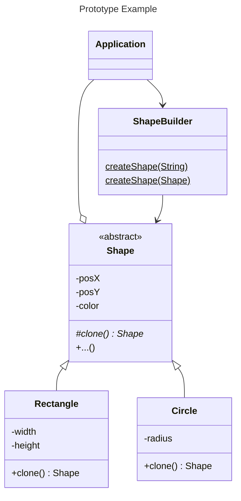

# The Prototype 

## The problem

We have an object that we want to creat a copy of it. But we may not have access to all of its fields to create a copy. 
To solve this we delegate the creation of object from itself via method `clone()`

